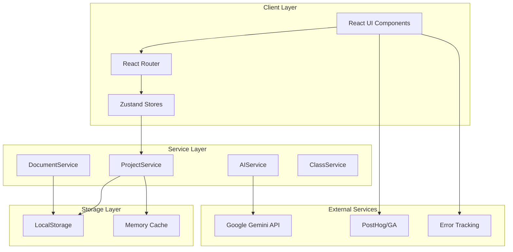

# Technical Architecture - Buffalo Projects

## System Architecture Overview



## Core Design Patterns

### 1. Service Layer Pattern

All business logic is encapsulated in service classes that act as singletons.

```typescript
// Pattern implementation
class ServiceName {
  private static instance: ServiceName;

  private constructor() {
    // Private constructor ensures singleton
  }

  public static getInstance(): ServiceName {
    if (!ServiceName.instance) {
      ServiceName.instance = new ServiceName();
    }
    return ServiceName.instance;
  }

  // Public methods for business logic
  public async performAction(params: Params): Promise<Result> {
    // 1. Validate inputs
    // 2. Execute business logic
    // 3. Handle errors
    // 4. Return typed result
  }
}
```

### 2. Store Pattern (Zustand)

State management uses Zustand with TypeScript for type safety.

```typescript
interface StoreState {
  // State
  data: DataType;
  loading: boolean;
  error: Error | null;

  // Actions
  fetchData: () => Promise<void>;
  updateData: (updates: Partial<DataType>) => void;
  resetStore: () => void;
}

const useStore = create<StoreState>((set, get) => ({
  // Initial state
  data: initialData,
  loading: false,
  error: null,

  // Actions implementation
  fetchData: async () => {
    set({ loading: true, error: null });
    try {
      const data = await service.getData();
      set({ data, loading: false });
    } catch (error) {
      set({ error, loading: false });
    }
  },
}));
```

### 3. Component Composition Pattern

Components are built using composition for maximum reusability.

```typescript
// Base component
const Card: FC<CardProps> = ({ children, className, ...props }) => (
  <div className={cn("rounded-lg bg-surface", className)} {...props}>
    {children}
  </div>
);

// Composed component
const ToolCard: FC<ToolCardProps> = ({ tool, onSelect }) => (
  <Card className="hover:scale-105 transition-transform">
    <CardHeader>{tool.name}</CardHeader>
    <CardContent>{tool.description}</CardContent>
    <CardFooter>
      <Button onClick={() => onSelect(tool)}>Select</Button>
    </CardFooter>
  </Card>
);
```

## Data Flow Architecture

### 1. Unidirectional Data Flow

```
User Action → Component → Store Action → Service → Storage → Store Update → Component Re-render
```

### 2. State Synchronization

```typescript
// Three-tier state management
// 1. Component State - UI-specific, temporary
const [isOpen, setIsOpen] = useState(false);

// 2. Store State - Shared across components
const workspace = useWorkspaceStore((state) => state.workspace);

// 3. Persistent State - Survives page refresh
localStorage.setItem("workspace", JSON.stringify(workspace));
```

### 3. Optimistic Updates

```typescript
// Update UI immediately, rollback on error
const updateCanvas = async (updates: CanvasUpdate) => {
  // 1. Optimistic update
  store.setCanvas(updates);

  try {
    // 2. Persist to storage
    await projectService.updateCanvas(updates);
  } catch (error) {
    // 3. Rollback on failure
    store.rollbackCanvas();
    throw error;
  }
};
```

## Storage Architecture

### LocalStorage Structure

```javascript
// Key naming convention: {prefix}_{identifier}
{
  "workspace_BUF-X7K9": {
    // Complete workspace data
  },
  "workspace_codes": ["BUF-X7K9", "BUF-A2B3"],
  "user_preferences": {
    // UI preferences
  },
  "cache_gemini_suggestions": {
    // Cached AI responses
  },
  "analytics_queue": [
    // Pending analytics events
  ]
}
```

### Storage Limits & Management

```typescript
// Storage quota management
const STORAGE_LIMIT = 10 * 1024 * 1024; // 10MB
const VERSIONS_TO_KEEP = 20;

const checkStorageQuota = () => {
  const usage = new Blob(Object.values(localStorage)).size;

  if (usage > STORAGE_LIMIT * 0.9) {
    // Clean up old versions
    pruneOldVersions();
  }
};
```

## API Integration Architecture

### Gemini AI Integration

```typescript
interface AIServiceArchitecture {
  // Request flow
  request: {
    throttling: "Rate limited to 60 RPM";
    caching: "Responses cached for 5 minutes";
    fallback: "Graceful degradation on failure";
  };

  // Context building
  context: {
    workspace: "Current canvas state";
    history: "Previous versions";
    documents: "Uploaded file content";
    projectType: "Student/Startup context";
  };

  // Response processing
  processing: {
    parsing: "JSON structured output";
    validation: "Schema validation";
    enrichment: "Add Buffalo context";
  };
}
```

## Security Architecture

### Client-Side Security

```typescript
// Input sanitization
const sanitize = {
  html: (input: string) => DOMPurify.sanitize(input),
  code: (input: string) => input.toUpperCase().replace(/[^A-Z0-9-]/g, ""),
  filename: (input: string) => input.replace(/[^a-zA-Z0-9.-]/g, "_"),
};

// API key protection
const secureApiCall = async (endpoint: string) => {
  const key = import.meta.env.VITE_API_KEY;
  if (!key || key === "your_api_key_here") {
    throw new Error("API key not configured");
  }
  // Make request
};
```

### Data Privacy

```typescript
// No PII stored
interface WorkspaceData {
  code: string; // Anonymous identifier
  projectName: string; // User-defined, not PII
  // No emails, names, or identifying info
}

// Analytics anonymization
posthog.capture("event", {
  workspace_code: hashCode(workspace.code),
  // No user identification
});
```

## Performance Architecture

### Code Splitting Strategy

```javascript
// Route-based splitting
const pages = {
  Landing: lazy(() => import("./pages/Landing")),
  Workspace: lazy(() => import("./pages/WorkspaceOptimized")),
  TeacherDashboard: lazy(() => import("./pages/TeacherDashboard")),
};

// Tool-based splitting
const tools = {
  Canvas: lazy(() => import("./tools/BusinessModelCanvas")),
  LeanCanvas: lazy(() => import("./tools/LeanCanvas")),
  MVPPlanner: lazy(() => import("./tools/MVPPlanner")),
};
```

### Optimization Techniques

```typescript
// 1. Debouncing expensive operations
const debouncedSave = debounce(saveWorkspace, 500);

// 2. Memoization of expensive computations
const pivotAnalysis = useMemo(
  () => analyzePivots(versions),
  [versions]
);

// 3. Virtual scrolling for lists
<VirtualList
  items={projects}
  itemHeight={80}
  renderItem={renderProjectCard}
/>

// 4. Image optimization
const optimizedImage = {
  loading: 'lazy',
  decoding: 'async',
  srcSet: 'image-320.webp 320w, image-640.webp 640w'
};
```

## Component Architecture

### Component Hierarchy

```
App
├── Router
│   ├── Layout
│   │   ├── Navigation
│   │   ├── Page Content
│   │   └── Footer
│   └── Error Boundary
├── Global Providers
│   ├── Theme Provider
│   ├── Analytics Provider
│   └── Error Provider
└── Modals/Overlays
```

### Component Categories

#### 1. Page Components (`/pages`)

- Own route
- Compose multiple features
- Handle page-level state

#### 2. Feature Components (`/components/tools`)

- Complex business logic
- Multiple sub-components
- Own local state

#### 3. UI Components (`/components/ui`)

- Pure presentation
- Highly reusable
- Props-driven

#### 4. Layout Components (`/components/layout`)

- Structure and navigation
- Responsive containers
- Consistent spacing

## Build & Deployment Architecture

### Build Pipeline

```yaml
pipeline:
  1_typecheck:
    - tsc --noEmit
  2_lint:
    - eslint src --ext .ts,.tsx
  3_test:
    - jest (planned)
  4_build:
    - vite build
  5_optimize:
    - terser compression
    - bundle analysis
  6_deploy:
    - vercel deployment
```

### Environment Configuration

```bash
# Development
.env.local
├── VITE_GEMINI_API_KEY=dev_key
├── VITE_API_URL=http://localhost:3000
└── VITE_DEBUG=true

# Production
.env.production
├── VITE_GEMINI_API_KEY=prod_key
├── VITE_API_URL=https://api.buffaloprojects.com
└── VITE_DEBUG=false
```

## Scalability Architecture

### Current MVP (0-1,000 users)

- LocalStorage for persistence
- Client-side processing
- Gemini API for AI

### Phase 2 (1,000-10,000 users)

```typescript
// Migration to Supabase
interface SupabaseArchitecture {
  database: "PostgreSQL";
  auth: "Supabase Auth";
  storage: "Supabase Storage";
  realtime: "WebSocket subscriptions";

  // Migration strategy
  migration: {
    dual_write: "Write to both LocalStorage and Supabase";
    gradual: "Migrate users in batches";
    fallback: "LocalStorage backup for offline";
  };
}
```

### Phase 3 (10,000+ users)

- Microservices architecture
- Redis caching layer
- CDN for static assets
- Horizontal scaling

## Error Handling Architecture

### Error Boundary Hierarchy

```typescript
// Global error boundary
<ErrorBoundary fallback={<ErrorPage />}>
  <App />
</ErrorBoundary>

// Feature-level boundaries
<ToolErrorBoundary fallback={<ToolError />}>
  <BusinessModelCanvas />
</ToolErrorBoundary>

// Component-level try-catch
try {
  await riskyOperation();
} catch (error) {
  logger.error('Operation failed', error);
  showUserNotification('Please try again');
}
```

### Error Recovery Strategies

1. **Automatic retry** - Network failures
2. **Fallback UI** - Component errors
3. **Cache fallback** - API failures
4. **Manual recovery** - Data corruption

## Testing Architecture

### Testing Pyramid

```
         /\
        /  \  E2E Tests (5%)
       /    \  - Critical user flows
      /      \  - Cross-browser testing
     /________\
    /          \  Integration Tests (25%)
   /            \  - Service interactions
  /              \  - Store updates
 /________________\
/                  \  Unit Tests (70%)
                    - Utilities
                    - Components
                    - Services
```

### Testing Strategy

```typescript
// Component testing
describe('BusinessModelCanvas', () => {
  it('should save changes on blur', async () => {
    const { getByTestId } = render(<BusinessModelCanvas />);
    const input = getByTestId('value-props-input');

    fireEvent.change(input, { target: { value: 'New value' } });
    fireEvent.blur(input);

    await waitFor(() => {
      expect(localStorage.getItem('canvas')).toContain('New value');
    });
  });
});
```

## Monitoring & Analytics Architecture

### Analytics Events Structure

```typescript
interface AnalyticsEvent {
  category: "workspace" | "tool" | "navigation" | "error";
  action: string;
  label?: string;
  value?: number;
  metadata?: Record<string, any>;
}

// Event examples
track("workspace", "created", "BUF-X7K9");
track("tool", "canvas_completed", undefined, 9);
track("error", "api_failure", "gemini_timeout");
```

### Performance Monitoring

```typescript
// Web Vitals tracking
const metrics = {
  FCP: "First Contentful Paint",
  LCP: "Largest Contentful Paint",
  FID: "First Input Delay",
  CLS: "Cumulative Layout Shift",
  TTFB: "Time to First Byte",
};

// Custom metrics
performance.mark("canvas_interactive");
performance.measure("canvas_load", "navigation", "canvas_interactive");
```

---

_This architecture document defines the technical foundation and patterns used throughout the Buffalo Projects codebase._
